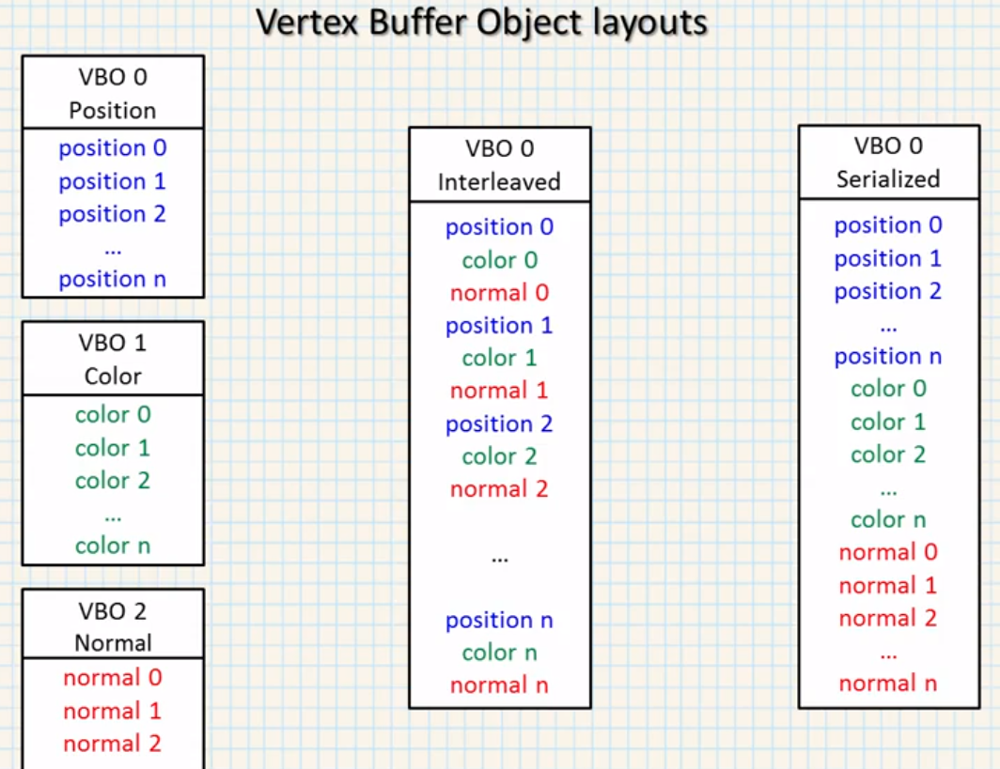
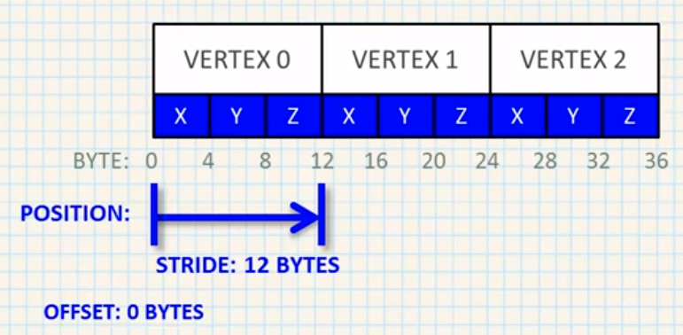
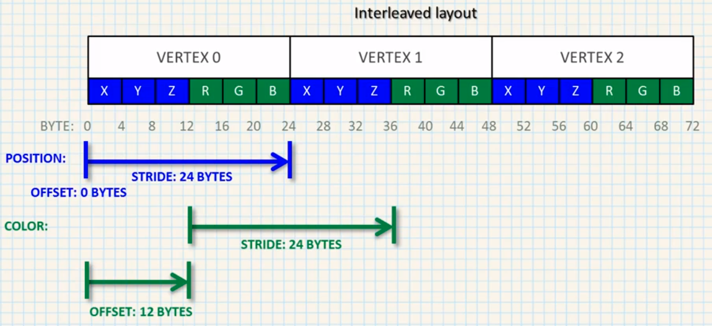
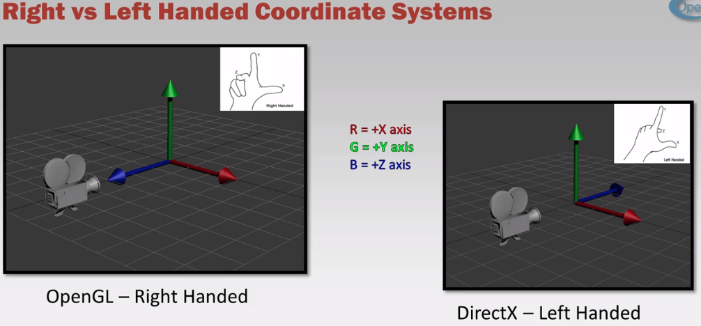
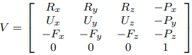
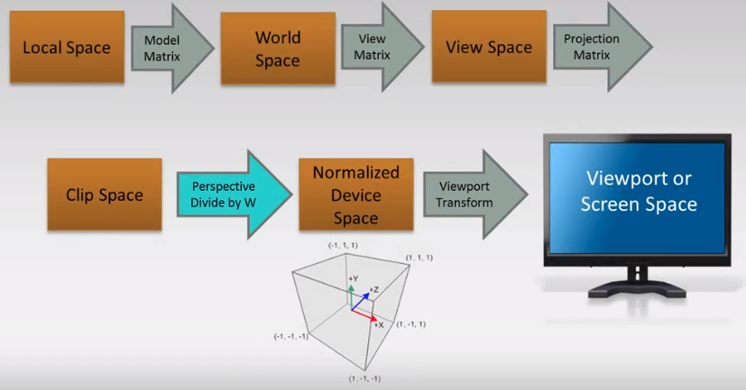
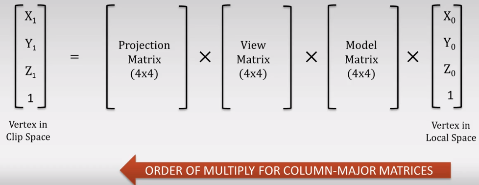
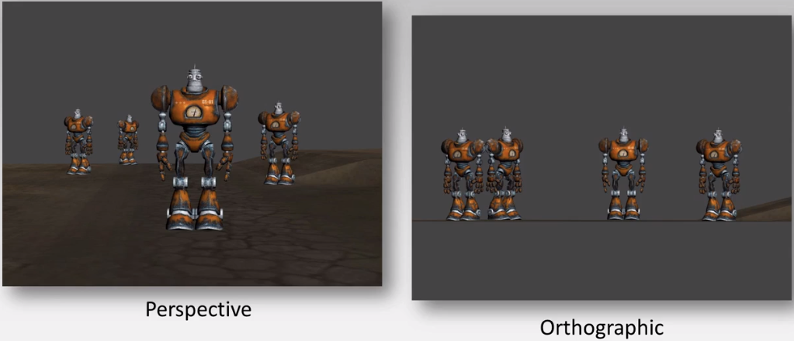

# OpenGL

- [OpenGL](#opengl)
  - [Documentation](#documentation)
    - [Tutorials](#tutorials)
    - [Websites](#websites)
    - [Books](#books)
    - [Videos](#videos)
  - [Basic steps for creating shaders](#basic-steps-for-creating-shaders)
  - [Vertex Buffer Object Layout](#vertex-buffer-object-layout)
  - [Coordinate Systems](#coordinate-systems)
    - [Orientation of the axes](#orientation-of-the-axes)
    - [Types of Spaces](#types-of-spaces)
      - [Local Space (Object Space)](#local-space-object-space)
      - [World Space](#world-space)
      - [View Space / Camera Space / View Space / Eye Space](#view-space--camera-space--view-space--eye-space)
        - [Description](#description)
        - [View Matrix](#view-matrix)
        - [Moving the Camera](#moving-the-camera)
        - [Turning the Camera](#turning-the-camera)
          - [Pitch](#pitch)
          - [Yaw](#yaw)
          - [Pitch and Yaw](#pitch-and-yaw)
      - [Clip Space (Normalized Device Coords)](#clip-space-normalized-device-coords)
      - [Screen Space](#screen-space)
    - [Coordinate Space Transformations](#coordinate-space-transformations)
      - [Projection Matrix](#projection-matrix)
  - [Glossary](#glossary)

## Documentation

### Tutorials

- [Udemy - Computer Graphics with Modern OpenGL and C++](https://www.udemy.com/course/graphics-with-modern-opengl/)
- [Udemy - Learn Modern OpenGL Programming](https://www.udemy.com/course/learn-modern-opengl-programming/)
- [Udemy - Learn GLSL Shaders from Scratch](https://www.udemy.com/course/learn-glsl-shaders-from-scratch/)

### Websites

- [docs.GL - API Reference](http://docs.gl/)
- [open.gl](https://open.gl/)
- [khronos - OpenGL](https://www.khronos.org/opengl/wiki/Main_Page)
- [learnopengl](https://learnopengl.com/Introduction)
- [ogldev](http://ogldev.atspace.co.uk/)
- [Anton's OpenGL 4 Tutorials](https://antongerdelan.net/opengl/)

### Books

- [Reference Cards](https://www.khronos.org/developers/reference-cards/)
- [Anton's OpenGL 4 Tutorials](https://www.amazon.com/gp/product/B00LAMQYF2/ref=as_li_tl?ie=UTF8&camp=1789&creative=9325&creativeASIN=B00LAMQYF2&linkCode=as2&tag=drantger-20&linkId=31e011e15c43803bca938150e5038782)
- [Computer Graphics Programming in OpenGL with C++](https://www.amazon.com/Computer-Graphics-Programming-OpenGL-C/dp/1683922212)
- [OpenGL Programming Guide: The Official Guide to Learning OpenGL, Version 4.5 with SPIR-V 9th Edition](https://www.amazon.com/OpenGL-Programming-Guide-Official-Learning/dp/0134495497/ref=pd_sbs_14_1/138-8200178-1350956?_encoding=UTF8&pd_rd_i=0134495497&pd_rd_r=5afa904d-add1-4fd8-85b0-34b3789e28b6&pd_rd_w=yF5uX&pd_rd_wg=Ov6Oy&pf_rd_p=ed1e2146-ecfe-435e-b3b5-d79fa072fd58&pf_rd_r=J6ZXEB1ARRQ0ZG1BZ8JW&psc=1&refRID=J6ZXEB1ARRQ0ZG1BZ8JW)
- [OpenGL 4 Shading Language Cookbook: Build high-quality, real-time 3D graphics with OpenGL 4.6, GLSL 4.6 and C++17, 3rd Edition](https://www.amazon.com/OpenGL-Shading-Language-Cookbook-high-quality/dp/1789342252/ref=sr_1_1?dchild=1&keywords=OpenGL+4.0+Shading+Language+Cookbook&qid=1607437662&s=books&sr=1-1)
- [OpenGL Superbible: Comprehensive Tutorial and Reference 7th Edition](https://www.amazon.com/OpenGL-Superbible-Comprehensive-Tutorial-Reference/dp/0672337479/ref=sr_1_1?dchild=1&keywords=OpenGL+Superbible&qid=1607435300&s=books&sr=1-1)
- [Real-Time Rendering, Fourth Edition 4th Edition](https://www.amazon.com/Real-Time-Rendering-Fourth-Tomas-Akenine-M%C3%B6ller/dp/1138627003/ref=pd_sbs_14_3/138-8200178-1350956?_encoding=UTF8&pd_rd_i=1138627003&pd_rd_r=5afa904d-add1-4fd8-85b0-34b3789e28b6&pd_rd_w=yF5uX&pd_rd_wg=Ov6Oy&pf_rd_p=ed1e2146-ecfe-435e-b3b5-d79fa072fd58&pf_rd_r=J6ZXEB1ARRQ0ZG1BZ8JW&psc=1&refRID=J6ZXEB1ARRQ0ZG1BZ8JW)

### Videos

- [Math for Game Developers - Jorge Rodriguez](https://www.youtube.com/watch?v=sKCF8A3XGxQ&list=PLW3Zl3wyJwWOpdhYedlD-yCB7WQoHf-My&ab_channel=JorgeRodriguez)

## Basic steps for creating shaders

1. Create Vertex Shader

   ```C++
   const GLchar* vertex_shader_src =
     "#version 330 core\n"
     "layout (location = 0) in vec3 pos;"
     "void main() {"
     "  gl_Position = vec4(pos, 1.0);"
     "}";

   GLuint vs = glCreateShader(GL_VERTEX_SHADER);
   glShaderSource(vs, 1, &vertex_shader_src, nullptr);

   const GLchar* fragment_shader_src =
     "#version 330 core\n"
     "out vec4 frag_color;"
     "void main() {"
     "  frag_color = vec4(1, 0, 0, 1);"
     "}";
   GLuint fs = glCreateShader(GL_FRAGMENT_SHADER);
   glShaderSource(fs, 1, &fragment_shader_src, nullptr);
   ```

2. Create Fragment Shader
3. Compile the Shaders

   ```C++
   glCompileShader(vs);
   GLint result;
   GLchar info_log[512];
   glGetShaderiv(vs, GL_COMPILE_STATUS, &result);
   if (!result) {
     glGetShaderInfoLog(vs, sizeof(info_log), nullptr, info_log);
     std::cerr << "Error: Vertex shader failed to compile: " << info_log << std::endl;
   }

   glCompileShader(fs);
   glGetShaderiv(vs, GL_COMPILE_STATUS, &result);
   if (!result) {
     glGetShaderInfoLog(vs, sizeof(info_log), nullptr, info_log);
     std::cerr << "Error: Fragment shader failed to compile: " << info_log << std::endl;
   }
   ```

4. Create a Shader Program

   ```C++
   GLuint shader_program = glCreateProgram();
   ```

5. Attach the shaders to the Program

   ```C++
   glAttachShader(shader_program, vs);
   glAttachShader(shader_program, fs);
   ```

6. Link the compiled shaders into a single Program

   ```C++
   glLinkProgram(shader_program);
   glGetProgramiv(shader_program, GL_LINK_STATUS, &result);
   if (!result) {
     glGetProgramInfoLog(shader_program, sizeof(info_log), nullptr, info_log);
     std::cerr << "Error: Shader Program linker failure: " << info_log << std::endl;
   }

   glDeleteShader(vs);
   glDeleteShader(fs);
   ```

7. Use the Program

   ```C++
   glUseProgram(shader_program);
   glDeleteProgram(shader_program);
   ```

## Vertex Buffer Object Layout

- All layouts



- Position layout



- Interleaved layout



## Coordinate Systems

### Orientation of the axes



### Types of Spaces

#### Local Space (Object Space)

- Game artists work in (where they build objects)
- They use Maya, 3ds Max, Blender

#### World Space

- The space the player is walking in

#### View Space / Camera Space / View Space / Eye Space

##### Description

- View Space is the co-ordinate system with each vertex as seen from the camera
- What the user sees, like looking through the camera lens
- The pyramid shape defines what the camera can see
- Everything is relative to the camera position
- The world is moving around the camera, not the other way around

##### View Matrix

- A View Matrix is needed to convert a vertex from World Space to View Space



- **P** - *Position* - The position of the camera in the World
- **R** - *Right* - Vector facing right of the camera (x-axis). Can calculate by doing the cross product of Direction vector and "up" world's vector ([0, 1, 0])
- **U** - *Up* - Upwards relative to where camera is facing. Can calculate by doing the cross product of Direction and Right vectors
- **F** - *Forward* - The direction the camera is looking in. Is negative because the world is moving in the opposite direction of the camera
- View Matrix could be computed using `glm::lookAt(position, target, up)`
  - *position* - Camera position
  - *target* - Point for camera to look at
  - *up* - The upwards direction of the World, not the camera. `glm::lookAt()` uses this to calculate camera's Right and Up
- The View Matrix needs to be bind to an uniform on the shader and applied between the projection and the model matrices
  > gl_Position = projection * view * model * vec4(pos, 1.0);

##### Moving the Camera

- Check the status of the keys
  > glfwGetKey(window, GLFW_KEY_W)
- Update the camera position while the key is pressed
- The delta could be computed based on the elapsed time in order to be portable for CPUs with different speed

##### Turning the Camera

- The camera could be turned on 3 types of angles
  - *Pitch* - Up/down
  - *Yaw* - Left/right
  - *Roll* - Like an screw placed on the forward direction. Not used that much
- Update the camera direction vector
  - Get *pitch* and *yaw* based on
    > glfwSetCursorPosCallBack(window, callback)
  - Store old mouse position and compare to the new position given by GLFW
  - Use the difference to decide pitch or yaw change
  - Use pitch and yaw to compute the new direction vector [x, y, z]

###### Pitch

- Needs to rotate the view up and down using an axis relative to the yaw
- It needs to update

  ```Text
  x = cos(pitch)
  y = sin(pitch)
  z = cos(pitch)
  ```

###### Yaw

- Rotates only up axis (Y-axis)
- It needs to update

  ```Text
  x = cos(yaw)
  z = sin(yaw)
  ```

###### Pitch and Yaw

- Combine the values from pitch and yaw to get a direction vector with those properties

  ```Text
  x = cos(pitch) x cos(yaw)
  y = sin(pitch)
  z = cos(pitch) x sin(yaw)
  ```

#### Clip Space (Normalized Device Coords)

#### Screen Space

### Coordinate Space Transformations





#### Projection Matrix



- Orthographic - Doesn't take in account the depth

## Glossary

- **GLEW**
  - *OpenGL Extension Wrangler*
  - Interface for OpenGL version above 1.1
  - Load OpenGL extensions
  - Some extensions are platform specific, GLEW can check if they exist on that platform
  - Alternatives: GL3W, glLoadGen, glad, glsdk, glbinding, libepoxy, Glee
  - How to use
    - `#include <GL/glew.h>`
    - After initialization of OpenGL context: `glewExperimental = GL_TRUE`
    - `glewInit()`
    - Should return `GLEW_OK`. If it fails, it returns the error
    - Can read error with `glewGetErrorString(result)`
    - Check extensions exist: `if (!GLEW_EXT_framebuffer_object)`
    - `wglew.h` for Windows only functions
- **GLFW**
  - *OpenGL FrameWork* (probably)
  - Handles window creation and control
  - Pick up and process input from the keyboard, mouse, joystick and gamepad
  - Multiple monitors support
  - Uses OpenGL context for windows
  - Alternatives
    - **SDL** - *Simple DirectMedia Layer*
      - Can do almost everything GLFW can do and more (audio, threading, filesystems, etc.)
    - **SFML** - *Simple and Fast Multimedia Library*
      - Like SDL, but with even more features
      - But the OpenGL context is very weak. Based on 2D only graphics
- **[glvnd](https://github.com/NVIDIA/libglvnd#architecture)**
  - *GL Vendor-Neutral Dispatch Library*
  - An abstraction layer that sends OpenGL calls to one of potentially many drivers
  - It allows multiple drivers from different vendors to coexist on the same filesystem, and determines which vendor to dispatch each API call to at runtime
  - [Architecture](https://github.com/NVIDIA/libglvnd#architecture)
- **NDC**
  - Normalized Device Coordinates

