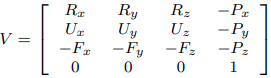
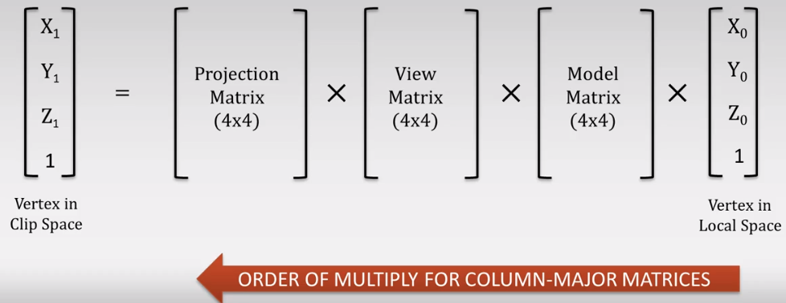

# Coordinate Systems

- [Coordinate Systems](#coordinate-systems)
  - [Orientation of the axes](#orientation-of-the-axes)
  - [Types of Spaces](#types-of-spaces)
    - [Local Space (Object Space)](#local-space-object-space)
    - [World Space](#world-space)
    - [View Space (Camera/Eye Space)](#view-space-cameraeye-space)
      - [Description](#description)
      - [View Matrix](#view-matrix)
      - [Moving the Camera](#moving-the-camera)
      - [Turning the Camera](#turning-the-camera)
        - [Pitch](#pitch)
        - [Yaw](#yaw)
        - [Pitch and Yaw](#pitch-and-yaw)
    - [Clip Space (Normalized Device Coords)](#clip-space-normalized-device-coords)
    - [Screen Space](#screen-space)
  - [Coordinate Space Transformations](#coordinate-space-transformations)
    - [Projection Matrix](#projection-matrix)

## Orientation of the axes


## Types of Spaces

### Local Space (Object Space)

- Game artists work in (where they build objects)
- They use Maya, 3ds Max, Blender

### World Space

- The space the player is walking in

### View Space (Camera/Eye Space)

#### Description

- View Space is the co-ordinate system with each vertex as seen from the camera
- What the user sees, like looking through the camera lens
- The pyramid shape defines what the camera can see
- Everything is relative to the camera position
- The world is moving around the camera, not the other way around

#### View Matrix

- A View Matrix is needed to convert a vertex from World Space to View Space



- **P** - *Position* - The position of the camera in the World
- **R** - *Right* - Vector facing right of the camera (x-axis). Can calculate by doing the cross product of Direction vector and "up" world's vector ([0, 1, 0])
- **U** - *Up* - Upwards relative to where camera is facing. Can calculate by doing the cross product of Right and Direction vectors
- **F** - *Forward* - The direction the camera is looking in. Is negative because the world is moving in the opposite direction of the camera
- View Matrix could be computed using `glm::lookAt(position, target, up)`
  - *position* - Camera position
  - *target* - Point for camera to look at
  - *up* - The upwards direction of the World, not the camera. `glm::lookAt()` uses this to calculate camera's Right and Up
- The View Matrix needs to be bind to an uniform on the shader and applied between the projection and the model matrices
  > gl_Position = projection * view * model * vec4(pos, 1.0);

#### Moving the Camera

- Check the status of the keys
  > glfwGetKey(window, GLFW_KEY_W)
- Update the camera position while the key is pressed
- The delta could be computed based on the elapsed time in order to be portable for CPUs with different speed

#### Turning the Camera

- The camera could be turned on 3 types of angles
  - *Pitch* - Up/down
  - *Yaw* - Left/right
  - *Roll* - Like an screw placed on the forward direction. Not used that much
- Update the camera direction vector
  - Get *pitch* and *yaw* based on
    > glfwSetCursorPosCallBack(window, callback)
  - Store old mouse position and compare to the new position given by GLFW
  - Use the difference to decide pitch or yaw change
  - Use pitch and yaw to compute the new direction vector [x, y, z]

##### Pitch

- Needs to rotate the view up and down using an axis relative to the yaw
- It needs to update

  ```Text
  x = cos(pitch)
  y = sin(pitch)
  z = cos(pitch)
  ```

##### Yaw

- Rotates only up axis (Y-axis)
- It needs to update

  ```Text
  x = cos(yaw)
  z = sin(yaw)
  ```

##### Pitch and Yaw

- Combine the values from pitch and yaw to get a direction vector with those properties

  ```Text
  x = cos(pitch) x cos(yaw)
  y = sin(pitch)
  z = cos(pitch) x sin(yaw)
  ```

### Clip Space (Normalized Device Coords)

### Screen Space

## Coordinate Space Transformations




### Projection Matrix


- Orthographic - Doesn't take in account the depth