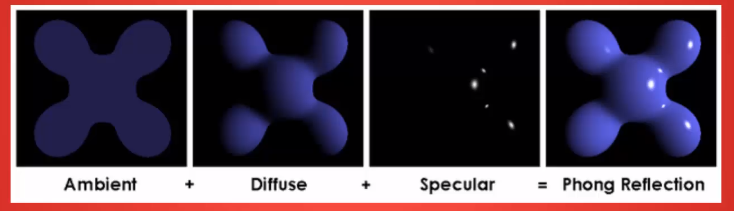
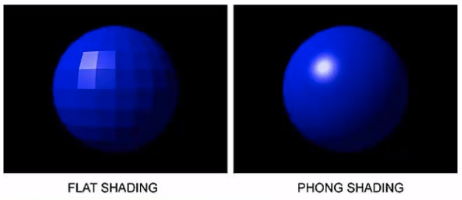
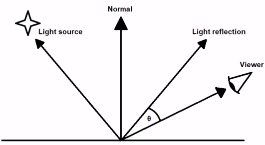
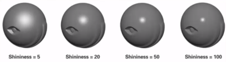

# Lighting

- [Lighting](#lighting)
  - [Phong Lighting Model](#phong-lighting-model)
    - [Ambient Lighting](#ambient-lighting)
    - [Diffuse Lighting](#diffuse-lighting)
    - [Specular Lighting](#specular-lighting)
  - [Types of Light](#types-of-light)
    - [Directional Light](#directional-light)

## Phong Lighting Model

Consists of 3 parts:

- *Ambient Lighting* - Light that is always present, even if a light source's direct path is blocked
- *Diffuse Lighting* - Light determined by direction of light source. Creates a faded effect further from the light
- *Specular Lighting* - Light reflected perfectly from the source to the viewer's eye. Effectively a reflection of the light source. More prominent on shiny object

### Ambient Lighting

- Light that is always present, even if a light source's direct path is blocked
- E.g. Creates a shadow on the ground with your hand, using the sun ... you can still see the colour in the shadow. It is still being lit
- Apply the light
  - Create an ambient lighting factor
  - _ambient = lightColour * ambientStrength_
  - This factor is how much of a fragment's colour this light's ambient shows
  - _fragColour = objectColour * ambient_
  - If *ambient* is 1 (full power) then the fragment is always fully lit
  - If *ambient* is 0.5 (half power) then the fragment is half its normal colour
  - If *ambient* is 0 (no power) then the fragment is always black

### Diffuse Lighting

- Light determined by direction of light source. Creates a faded effect further from the light
- Simulates the drop-off of lighting as angle of lighting becomes more shallow
- Side facing directly at a light is brightly lit
- Side facing at an angle is more dim
- Can use the angle between the vector connecting light source to fragment and the vector perpendicular to the face (surface "normal" vector)
- Apply the light
  - _fragColour = objectColour * (ambient + diffuse)_
  - *v1 &#8226; v2 = |v1| x |v2| x cos(&theta;)*
  - If both vectors are normalized (converted to unit vectors)
  - Then: *|v1| = |v2| = 1*
  - So: *v1 &#8226; v2 = cos(&theta;)*
  - Since *cos(0) = 1* and *cos(90) = 0*
  - We can use the output of *v1 &#8226; v2* to determine a diffuse factor (1 - fully lit; 0 - fully dim)
- Normals
  - Flat Shading
    - Define normals for each face
    - Each vertex will have multiple normals, one for each face it is part of
    - Good for "Flat Shading", not good for realistic smooth shading
    - Also doesn't work too well for indexed draws: we only define each vertex once per face
  - Phong Shading (not Phong Lighting!)
    - Each vertex has an average of the normals of all the surfaces it is part of
    - Interpolate between these averages in shader to create smooth effect
    - Good for complex models
    - Not so good for simple models with sharp edges (unless you use some clever modelling techniques)
    - Problem with non-uniform scales
      - Wrongly skewing normals
      - It can be countered by creating a "normal matrix" from model matrix
      - Transform normals with: *mat3(transpose(inverse(model)))*
    - 

### Specular Lighting

- Light reflected perfectly from the source to the viewer's eye. Effectively a reflection of the light source. More prominent on shiny object
- Relies on the position of the viewer
- Moving around will affect the apparent position of the specular reflection on the surface
- Therefore, we need four vectors to compute the angle between the viewer and the reflection
  - Light vector
  - Normal vector
  - Reflection vector (Light vector reflected around Normal)
    - Computed with GLSL: *reflect(light_vector, normal_vector)*
  - View vector (vector from viewer to fragment)
- 
  - Smaller &theta; => More light
  - Larger &theta; => Less light
- Use dot product between normalized forms of view and reflection vector to get Specular Factor
- Shininess
  - Creates a more accurate reflection
  - Higher shine: Smaller, more compact specular
  - Lower shine: Larger, faded specular
  - 
  - *specularFactor = (view &#8226; reflection)shininess*
- Apply the light
  - _frag_colour = object_colour * (ambient + diffuse + specular)_

## Types of Light

- *Directional Light* - A light without a position or source. All light is coming as parallel rays from an seemingly infinite distance. Ex: the Sun
- *Point Light* - A light with a position that shines in all directions. Ex: a lightbulb
- *Spot Light* - Similar to a Point Light, but cut down to emit in a certain range, with a certain angle. Ex: a flashlight
- *Area Light* - More advanced light type that emits light from an area. Ex: A large light up panel on a wall or ceiling

### Directional Light

- A light without a position or source. All light is coming as parallel rays from an seemingly infinite distance. Ex: the Sun
- Requires only basic information: colour, ambient, diffuse, specular and a direction
- Treat all light calculations using the same direction for the light vector
- Don't need to calculate a light vector