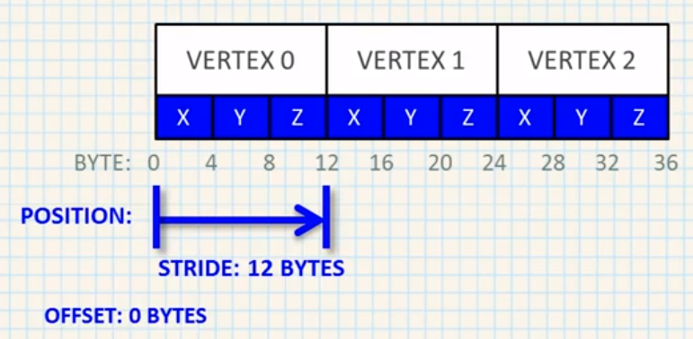

# Shaders

- [Shaders](#shaders)
  - [Basic steps for creating shaders](#basic-steps-for-creating-shaders)
  - [Vertex Buffer Object Layout](#vertex-buffer-object-layout)

## Basic steps for creating shaders

1. Create Vertex Shader

   ```C++
   const GLchar* vertex_shader_src =
     "#version 330 core\n"
     "layout (location = 0) in vec3 pos;"
     "void main() {"
     "  gl_Position = vec4(pos, 1.0);"
     "}";

   GLuint vs = glCreateShader(GL_VERTEX_SHADER);
   glShaderSource(vs, 1, &vertex_shader_src, nullptr);

   const GLchar* fragment_shader_src =
     "#version 330 core\n"
     "out vec4 frag_color;"
     "void main() {"
     "  frag_color = vec4(1, 0, 0, 1);"
     "}";
   GLuint fs = glCreateShader(GL_FRAGMENT_SHADER);
   glShaderSource(fs, 1, &fragment_shader_src, nullptr);
   ```

2. Create Fragment Shader
3. Compile the Shaders

   ```C++
   glCompileShader(vs);
   GLint result;
   GLchar info_log[512];
   glGetShaderiv(vs, GL_COMPILE_STATUS, &result);
   if (!result) {
     glGetShaderInfoLog(vs, sizeof(info_log), nullptr, info_log);
     std::cerr << "Error: Vertex shader failed to compile: " << info_log << std::endl;
   }

   glCompileShader(fs);
   glGetShaderiv(vs, GL_COMPILE_STATUS, &result);
   if (!result) {
     glGetShaderInfoLog(vs, sizeof(info_log), nullptr, info_log);
     std::cerr << "Error: Fragment shader failed to compile: " << info_log << std::endl;
   }
   ```

4. Create a Shader Program

   ```C++
   GLuint shader_program = glCreateProgram();
   ```

5. Attach the shaders to the Program

   ```C++
   glAttachShader(shader_program, vs);
   glAttachShader(shader_program, fs);
   ```

6. Link the compiled shaders into a single Program

   ```C++
   glLinkProgram(shader_program);
   glGetProgramiv(shader_program, GL_LINK_STATUS, &result);
   if (!result) {
     glGetProgramInfoLog(shader_program, sizeof(info_log), nullptr, info_log);
     std::cerr << "Error: Shader Program linker failure: " << info_log << std::endl;
   }

   glDeleteShader(vs);
   glDeleteShader(fs);
   ```

7. Use the Program

   ```C++
   glUseProgram(shader_program);
   glDeleteProgram(shader_program);
   ```

## Vertex Buffer Object Layout

- All layouts


- Position layout



- Interleaved layout


